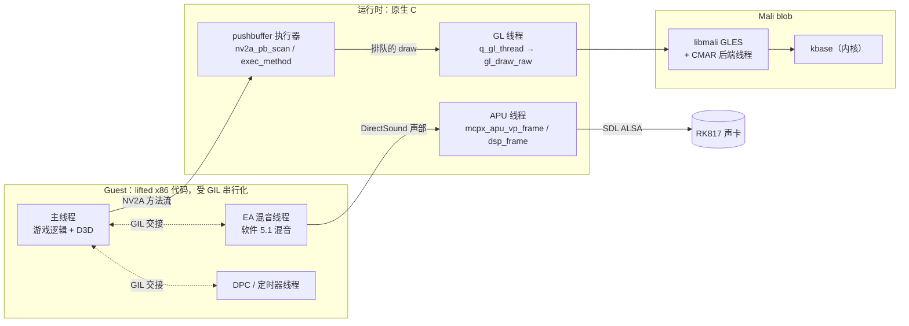
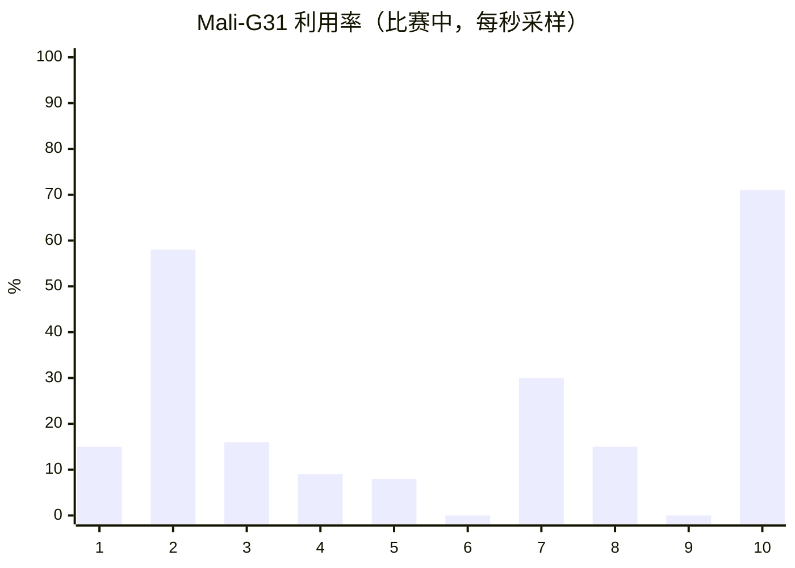
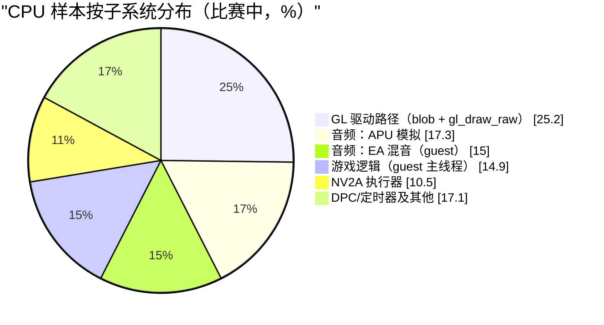
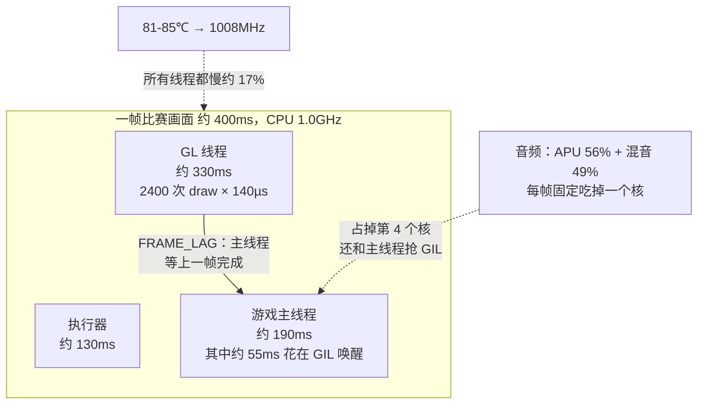
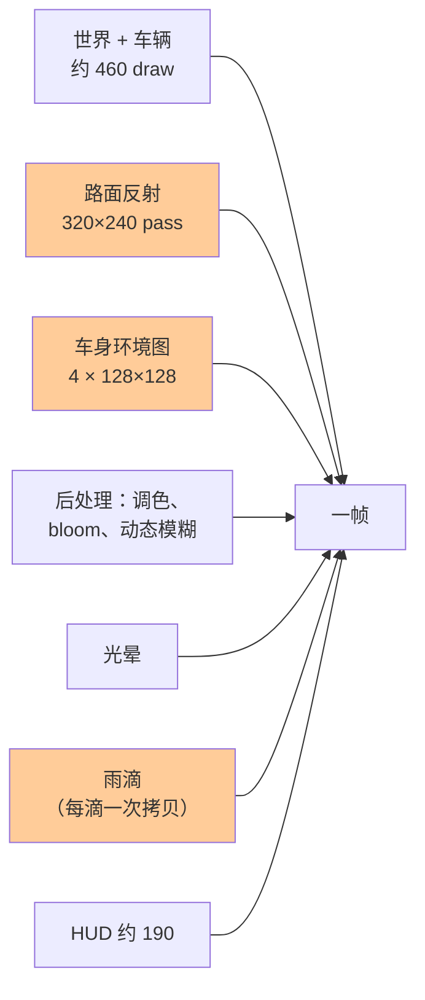
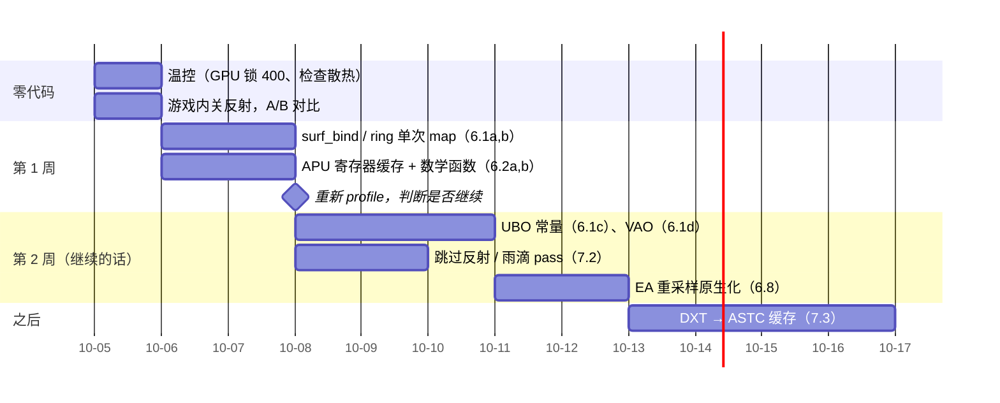

# 02 - NFSU2（Xbox 静态重编译）R36S 性能分析与优化方案

> 状态：分析 v1（2026-10-03）。数据均为真机实测；标 *（估）* 的是推算值。
> 前置文档：[01 Windows 移植复盘](01-Windows移植复盘.md)（运行时架构和移植踩坑）。
> 构建：`main` @ `71ab10f`（GLES 渲染器、`XBOXRECOMP_EMBEDDED`、`-O2 -mcpu=cortex-a35`）。启动脚本是 `r36s/Need for Speed Underground 2.sh`，开了 `RECOMP_GL_THREAD=1 RECOMP_FRAME_LAG=1 RECOMP_GIL_EAGER=1`。
> 设备：R36S，RK3326（4× Cortex-A35），Mali-G31 MP1（blob r13p0，GLES 3.2，**不支持 S3TC**），1GB 内存，dArkOS，内核 4.4。
> 参考：`PERF_NOTES.md`（作者在 Switch 上的优化记录，本文以它为基础）；`PortMaster/re3-sdl/docs/03、07、08、09`（reVC 在同一台设备上的优化记录）。

## 1. 结论速览

| 项 | 实测 |
|---|---|
| 比赛帧率 | **1.6-3.0 fps**（每帧 340-500ms，每帧约 2000-2700 次 draw） |
| 菜单 / 过场视频 | 10-25 fps / 12-16 fps |
| GPU 利用率 | 平均 **约 20%**（单次采样 0-71%），频率 400-520MHz |
| CPU | 4 核合计约 81% 忙，温度 81-85℃，**被温控压到 1008MHz** |
| 判断 | 瓶颈在 CPU：主要是驱动调用路径和音频模拟。GPU 大部分时间闲着 |

比赛要达到可玩的 20fps 以上，需要提速 **约 8-10 倍**。§6 的方案投入中等工作量，预计能做到 **3-5 倍**（6-12fps）*（估）*。再往上，要么砍渲染通道（画质明显下降），要么换设备。这是本文最核心的结论，§8 据此给出继续或止损的判断点。

## 2. 一帧是怎么产生的



游戏每发出一次 draw，要依次经过五层：
1. guest 的 D3D 代码（lifted）；
2. 执行器解码 NV2A 方法；
3. 进 GL 线程队列，再在 GL 线程回放；
4. `gl_draw_raw` 做状态比对；
5. 向 blob 发 6-15 次 GL 调用。

## 3. 实测数据

### 3.1 测量方法

- **CPU 采样**：在设备上运行 `perf record -F 999 -g -p <pid> -- sleep 15`。设备的 `perf_event_paranoid=1`，用 ark 用户即可，不需要 sudo。采集时正在比赛，共 48748 个样本。
- **线程和符号归属**：用 `perf script` 的**栈顶帧**统计。这份数据里 perf 自带的 `--tid` 过滤不可靠，所以没用。
- **进入 blob 的调用点**：取调用栈里第一个落在我们二进制内的返回地址，在交叉编译镜像里用 `objdump` / `addr2line` 反查到源码。
- **GPU**：读 `/sys/class/misc/mali0/device/utilisation`（kbase 统计，100ms 窗口）和 devfreq 的 `load`，每秒一次，共 10 秒。
- **线程 CPU 和频率温度**：`r36s/threads.sh` 读 `/proc/<pid>/task/*/stat` 算各线程 CPU 占用，同时记录 CPU/GPU 频率和温度。

### 3.2 GPU



平均约 22%。GPU 大部分时间在等命令，所以分辨率、shader 复杂度、填充率**都不是**当前的帧率瓶颈。reVC 的情况不同：一帧 30ms 里 GPU 要忙 10-12ms（docs/08）。

### 3.3 各线程 CPU 占用（单核百分比）

| # | 线程 | 单核 % | 主要时间去向 |
|---|---|---|---|
| 1 | GL 线程（`q_gl_thread`） | **82** | libmali 56，`gl_draw_raw` 9，libc 8，内核 4 |
| 2 | APU（`mcpx_apu_vp_frame`） | **56** | 声部处理 41，`xbox_ContiguousIsPhysical` 4，tanhf/powf 4 |
| 3 | EA 混音（guest） | 49 | lifted 混音代码（`sub_0027CCF0` 重采样、`sub_0027AF30`），内核 13 |
| 4 | 游戏主线程（guest） | 48 | lifted 游戏代码 32，内核 14（`gil_unlock` → `pthread_cond_broadcast`） |
| 5 | pushbuffer 执行器 | 34 | `nv2a_pb_exec_method` 14，`nv2a_pb_scan` 6，`q_rows_diff` 4 |
| 6 | DPC / 定时器线程 | 21 | 大部分在内核（线程唤醒），`ke_shadow_lookup` |
| | **合计** | **约 325 / 400** | |



### 3.4 热点符号（self 时间，全部线程）

| 排名 | 符号 | % | 所在线程 |
|---|---|---|---|
| 1 | libmali（分散在各处，没有单个特别热的函数） | 17.3 | GL 线程 |
| 2 | `mcpx_apu_vp_frame`（内联了 `voice_process`） | 12.5 | APU |
| 3 | 内核（futex 和调度唤醒） | 合计约 16 | 主线程、混音、DPC |
| 4 | `nv2a_pb_exec_method` | 4.4 | 执行器 |
| 5 | `gl_draw_raw` | 2.8 | GL 线程 |
| 6 | `nv2a_pb_scan` | 1.9 | 执行器 |
| 7 | `sub_0027CCF0` / `sub_0027AF30`（EA 混音） | 1.6 / 1.4 | guest 混音 |
| 8 | `sub_002213EA`（最热的游戏函数） | 1.4 | guest 主线程 |
| 9 | `q_rows_diff` | 1.3 | 执行器 |
| 10 | `xbox_ContiguousIsPhysical` | 1.1 | APU |

### 3.5 blob 时间按 GL 调用点拆分（GL 线程）

| 调用点 | 占 blob 时间 | 内容 |
|---|---|---|
| `gl_draw_raw` 直接调用 | 约 72% | uniform、渲染状态、`glDrawElements` |
| `surf_bind` | 约 13% | 每次 draw 都调 `glBindFramebuffer` 和 `glViewport` |
| `ring_alloc` | 约 8% | 每次 draw 都做 `glMapBufferRange`（顶点、索引各一次） |
| `bind_tex`、`gl_clear` 等 | 约 7% | |

按每帧约 2400 次 draw、GL 线程约 330ms 算，在 1GHz 下**每次 draw 约 140µs**。

reVC 在同一个 blob 上的数据是约 25µs/次（约 440 次 draw 花 20ms，docs/08）。它用了 VAO，状态设置也都有脏检查。NFSU2 的 draw 数是 reVC 的 5 倍，单次开销也是 5 倍。

### 3.6 其他事实

- **温度**：81-85℃，触发被动温控，CPU 被压到 1008MHz。启动脚本设的上限是 1209MHz。
- **纹理**：Mali 不支持 S3TC，DXT 纹理只能在 CPU 上解码。整个会话累计上传 91.6MB、耗时 8.0s，大部分发生在加载阶段；比赛中途的上传会表现为 100ms 以上的卡顿。
- **内存**：已用 590MB，可用 304MB，swap 未使用，暂时不是限制。
- **每帧 draw 数**（来自卡顿日志）：p10 = 3，p50 = 1965，p90 = 2405。

## 4. reVC 在同一设备上的经验，哪些用得上

| reVC 的结论（出处） | 对 NFSU2 是否适用 |
|---|---|
| CPU 提交路径在 blob 里的开销是主要瓶颈（08 §2） | **适用，而且更严重**：draw 数是 reVC 的 5 倍 |
| blob 开销按调用次数计、很分散，要靠减少调用而不是加快调用（08 §2） | 适用，这是 §6.1 的依据 |
| 合批或按纹理排序有没有用，看每张纹理被多少次 draw 用到，大于 3 才值得（08 §4） | 先测量再决定（§6.1） |
| fp16 / mediump 没有提速，画质还变差（08 §5） | 适用，不做。GPU 本来就闲 |
| 三缓冲，帧率 +70%（09） | **暂不适用**：现在的瓶颈不是等 GPU。等 CPU 侧每帧压到 40ms 以内再看 |
| 用 ASTC 4x4 替代 DXT：帧率 +40%，内存省 237MB（07） | **适用**：同一个 blob，同样缺 S3TC（§7.3） |
| 温控组合 CPU 1209 / GPU 400、read-ahead、swappiness（03 §5A） | 已部分采用，但仍在降频。GPU 可以锁 400MHz（我们只用到约 20%），把温度余量让给 CPU |
| 降低音频采样率、减少声源能便宜地省 CPU（03） | 适用，改的是我们自己的 APU 模拟（§6.2） |
| 不要用 root 跑游戏；不开 LTO（AGENT.md） | 保持 |

## 5. 瓶颈模型



GL 线程决定帧时间。开了 `RECOMP_FRAME_LAG` 后，主线程要等 GL 线程画完上一帧。音频则固定占掉 4 个核中的大约一个。

## 6. 优化方案与 ROI

ROI 指预期比赛帧率收益与工作量之比。下表中各项的收益都是单独估算的，针对的是 GL 线程决定帧时间的现状 *（估）*，**不能直接相加**。

| # | 项 | 工作量 | 预期收益（比赛） | 风险 | ROI |
|---|---|---|---|---|---|
| 6.1a | `surf_bind` 中跳过冗余的 `glBindFramebuffer`/`glViewport` | 0.5 天 | GL 线程 -10% | 低 | **高** |
| 6.1b | 顶点/索引 ring 改为每帧只 map 一次（或批量 `glBufferSubData`） | 1 天 | GL 线程 -8% | 低 | **高** |
| 6.1c | 192 个 VS 常量和每 draw 参数改用 UBO，减少 `glUniform*` 调用 | 2 天 | GL 线程 -15~25% | 中 | 高 |
| 6.1d | 按顶点布局缓存 VAO（reVC 实测提交侧省 1ms） | 1 天 | GL 线程 -5% | 低 | 中 |
| 6.2a | APU：每个声部每帧只读一次寄存器。现在每个声部每帧约 60 次 `ldl_le_phys`，每次都要经过 `xbox_ContiguousIsPhysical` | 1 天 | APU -40%（约 0.2 核） | 低 | **高** |
| 6.2b | APU：`powf`/`tanhf` 改成查表或 `exp2f`，跳过静音的 mixbin | 0.5 天 | APU -10% | 低 | 中 |
| 6.2c | 主机侧音频降到 24kHz，求和的 mixbin 减少 | 0.5 天 | APU -20% | 音质 | 中 |
| 6.3 | GIL：没有等待者时不做 `pthread_cond_broadcast`，能用 signal 时不用 broadcast | 1 天 | 主线程 -10%，内核态时间减少 | 中（线程竞态，见 CLAUDE.md） | 中 |
| 6.4 | 加载时把 DXT 转成 ASTC 4x4 并缓存到 SD 卡，走 reVC docs/07 的路线 | 3-5 天 | 消除卡顿，降低 GPU 带宽 | 中 | 中（改善的是加载和卡顿，不是稳态帧率） |
| 6.5 | 温控：GPU 锁 400MHz，CPU 上限 1209MHz 并压在 70℃ 以下（需要加散热） | 0 天 | 整体 +15~20% | 无 | **高** |
| 6.6 | 砍渲染通道（见 §7） | 每项 1-3 天 | draw 数最多减半 | 画质 | 高，但要牺牲画质 |
| 6.7 | 用原生 C 重写 lifted 热点函数（§6.8） | 每个 1-3 天 | 每个 1-2% | 中 | **低** |

### 6.8 重写 lifted 热点函数的 ROI

这个方法在 Switch 上已经验证过：作者用原生代码重写了 `sub_0009A330` 视锥剔除，对比 1100 万次调用 0 处不一致（见 PERF_NOTES.md）。但在 R36S 上，lifted 游戏代码**不是**主要瓶颈：

- **游戏逻辑很分散。** 最热的单个游戏函数 `sub_002213EA` 只占 1.4% 样本；guest 主线程的全部 lifted 代码加起来约 10%。把前 10 个游戏函数全部重写，收益不到 5% 帧时间，却要 1-2 周，而且每个函数都要配一个对照校验模式。
- **EA 混音器是唯一值得重写的。** 它的 lifted 代码（`sub_0027CCF0` 重采样、`sub_0027AF30`、`sub_00271417`、`sub_0027C040`）合计约 5%。值得做的原因：
  - Switch 笔记已经写清楚了算法：EA-XA 32kHz 重采样到 48kHz，32.32 定点，线性插值；
  - 代码自成一体，不牵连其他模块；
  - 可以做逐位比对的参照，照搬 `NFSU2_NATIVE_*` 那种对照校验模式；
  - 能省出小半个核。

**结论**：重写混音重采样器，约 2 天，省约 0.2 核。游戏逻辑先不重写，等 GL 路径和音频路径修完、新的 profile 里出现集中的热点再说。

## 7. Shader、特效与材质

### 7.1 Shader 开销

GPU 只忙约 20%，所以简化 shader **现在不会提高帧率**。

现状：
- 片元着色器（`gl_psh.c` 生成的 combiner shader）是直线式 ALU 运算，最多 4 次纹理采样，外加一个 alpha test 的 `discard`；
- 顶点着色器直接执行游戏的 NV2A 顶点程序，最多 136 条指令，带 `c[192]` 常量。

以下几点等 CPU 侧修完再考虑：

- **`discard` 保留。** Mali 上它会关掉 early-Z，但树叶、栅栏、HUD 都用固定管线的 alpha test，去掉会画错。
- **两个运行时分支改成编译期常量。** 每次 draw 都要判断的 `u_alpha_func` 分支链，以及 ES 顶点收尾里 16 路的 `u_bgra` 选择，都可以作为 shader key 的一部分编进程序。这样每次 draw 还能少传两个 uniform，对 §6.1c 也有帮助。
- **精度保持 highp。** reVC 在这个 blob 上试过 mediump，帧率没变，画面还坏了（08 §5）。

### 7.2 砍特效（减少 draw 数的真正手段）

一帧比赛画面的构成（来自 Switch 笔记和本次日志），目标帧率 30fps（每两个 vblank 一帧）：

| 组成 | draw 数 / 说明 |
|---|---|
| 世界 + 车辆 | 约 460 |
| **两个反射 pass** | 路面反射 320×240，车身环境图 4 × 128×128 |
| 后处理 | 调色 LUT、bloom/模糊 |
| 光晕 | |
| 雨滴 | 每个雨滴都要拷一次 back buffer |
| HUD | 约 190 |



候选项按优先级排列（图中橙色），每一项都要在同一段固定赛道上对比前后的 draw 数：

1. **反射 pass。** 游戏自己的视频设置里有路面反射和车身反射的画质选项，保存在存档里。先在游戏里把它们关掉，不用改代码。如果还不够，再在执行器里按颜色目标识别反射 surface（地址和尺寸：320×240、128×128），直接跳过画到这些目标上的 draw。
2. **雨滴。** 每个雨滴都要拷贝一次 back buffer 再画一次（CLAUDE.md，`sub_000A6530`），下雨时会产生几十次 pass 切换。目标是 32×32 雨滴 surface 时直接跳过。
3. **后处理。** 只对全屏 pass 降低渲染分辨率。

预期 *（估）*：反射约占比赛 draw 数的 30-40%。光去掉反射，GL 线程就能从约 330ms 降到约 200ms。

### 7.3 材质 / 纹理

- **DXT 转 ASTC 4x4。** 原因和 reVC docs/07 一样：同一个 blob，同样不支持 S3TC。但 NFSU2 的资源在 EA 的 `ZZDATA*.BIN` 流文件里，不像 reVC 那样方便离线重打包。所以改为上传纹理时转码，按纹理哈希持久化缓存到 SD 卡。编码器用 aarch64 版 `astcenc`（PortMaster 自带 `astcenc.aarch64`）。reVC 踩过的坑要注意两点：只能用 4x4 块；纹理上下方向。
- **低成本过渡方案。** 没有 alpha 或只有 1 位 alpha 的纹理，把 DXT 解成 RGB565 / RGBA4444。上传量和带宽减半，也不用引入新依赖。
- **纹理预算。** 显式设置 `RECOMP_GL_TEX_MB`。设备总内存只有 1GB。

## 8. 推进顺序与止损判断



**第 1 周结束时判断是否继续**：关掉反射、做完 GL 和 APU 两项修复之后，如果比赛帧率仍低于约 6fps，RK3326 就达不到 20fps。届时有两个方向：
- 本作在 R36S 上只定位为"菜单和展示可用"；
- 换到 RK3566 档的设备（A55 + Mali-G52，软件栈相同）。

## 9. 复现测量

```sh
# 编译 + 部署
sg docker -c 'r36s/build.sh'
sshpass -p ark scp build-r36s/nfsu2_recomp ark@192.168.3.71:/roms/ports/nfs8/
# 从 EmulationStation 启动并进入比赛，然后：
sshpass -p ark ssh ark@192.168.3.71 'sh /roms/ports/nfs8/threads.sh 10'
sshpass -p ark ssh ark@192.168.3.71 'perf record -F 999 -g -p $(pidof nfsu2_recomp) -o /tmp/nfs.perf -- sleep 15'
# GPU 利用率（kbase，百分比）：
sshpass -p ark ssh ark@192.168.3.71 'cat /sys/class/misc/mali0/device/utilisation'
# 帧率 / 卡顿：
sshpass -p ark ssh ark@192.168.3.71 'grep -E "^\[fps\]|\[hitch\]" /roms/ports/nfs8/log.txt | tail'
```

每个数据都要同时记下 CPU 频率和温度。81℃ 时 CPU 实际频率比启动脚本设的上限低 17%，不记的话前后数据没法比较。
