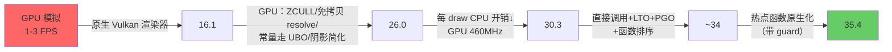
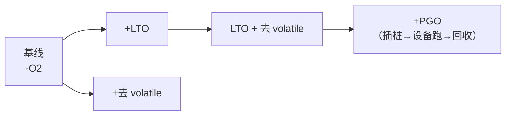

# 03 - 同类项目对比与可借鉴方案（ReXGlue / nfsmw-nx）

> 状态：分析 v1（2026-10-03）。对比对象已 clone 到 `PortMaster/rexglue-sdk`、`PortMaster/nfsmw-nx`。
> 前置文档：[02 R36S 性能分析与优化方案](02-R36S性能分析与优化方案.md)。
> 结论先行：nfsmw-nx 在 Switch **默认频率下是 30 FPS 目标**（比赛均值 32-35，最重区域 21-22），60 FPS 需要超频。它比 nfsu2-sw on R36S 快，是**源平台更好译 + 目标平台更强 + 几个月的打磨**三者叠加；其中可迁移到 R36S 的是**构建优化（LTO/PGO）**和**带校验的原生替换**，图形驱动层不可迁移。

## 1. 两个项目是什么

| 项目 | 内容 |
|---|---|
| **rexglue-sdk** | Xbox 360 PowerPC → C++ 静态重编译 SDK（源自 Xenia）。上游 GPU 后端只有 D3D12 / Vulkan，做的是 Xenos GPU 模拟，没有 GL/GLES |
| **nfsmw-nx** | 基于 ReXGlue 的《极品飞车：最高通缉》Xbox 360 版 Switch 移植。三件套：自写 Vulkan 原生渲染器（读 PM4 命令流重建帧）、改过的 Mesa/NVK 驱动、XenosRecomp 预翻译的着色器库 |

## 2. 平台与方案对比

| | nfsmw-nx（Switch） | nfsu2-sw（R36S） |
|---|---|---|
| 源平台 | Xbox 360：PowerPC，3 核 3.2GHz | Xbox：x86 Pentium III 733MHz，单核 |
| 重编译 | PPC → C++（ReXGlue） | x86 → C（xboxrecomp） |
| 目标 CPU | 3× Cortex-A57 @1020MHz，乱序 | 4× Cortex-A35 @1.0-1.3GHz，**顺序**（实测常被温控压到 1008MHz） |
| 目标 GPU | Maxwell GM20B 256 核 @460MHz | Mali-G31 MP1 @400-520MHz，闭源 blob |
| 图形 API / 驱动 | Vulkan / NVK（开源，可打补丁） | GLES 3.2 / libmali（闭源，不可改） |
| 渲染器思路 | 读 PM4 命令 → 自己录 Vulkan 命令 | 读 NV2A pushbuffer → 自己发 GL 调用（**思路相同**） |
| 构建 | 直接调用 + LTO + PGO + 函数排序 | -O2，无 LTO |
| 原生替换 | 材质/特效/可见性/矩阵/D3D 状态等，每个带 guard | 上游只做了 2 个剔除函数 |
| 比赛帧率 | 32-35 FPS | 4-5 FPS |

## 3. nfsmw-nx 的优化历程（引自其 docs/performance-history.md）



对照 nfsu2-sw：**第一步（GPU 模拟 → 原生渲染器）上游已做**——pushbuffer → GL 就是它的"原生渲染器"。差距在后三步：每 draw 开销、构建优化、原生替换。

## 4. 为什么它的游戏代码快得多

ReXGlue 生成代码同样是**每次访存 volatile**，还多一次字节序翻转：

```c
#define REX_LOAD_U32(x) __builtin_bswap32(*(volatile u32*)(base + (u32)(x) + REX_PHYS_HOST_OFFSET(x)))
```

所以 volatile 本身不是决定因素，**访存次数**才是：

| | PowerPC → C | x86 → C |
|---|---|---|
| 通用寄存器 | 32 个，全部可做 C 局部变量 | 8 个，频繁溢出到栈 |
| 传参 | 寄存器 | 栈：每次 push/pop 都是一次 guest 内存访问 |
| 标志位 | 只有比较指令写 CR | 几乎每条 ALU 指令都写 EFLAGS |
| 浮点 | 32 个 FPR | x87 栈，模型放在内存数组里 |

nfsu2 生成代码里有约 23 万处 `PUSH32`、28 万处 `MEM32`、22 万处标志位临时变量；热点函数 55-65% 的指令是 load/store。在**顺序执行**的 A35 上，这类访存密集代码比在 A57 上更吃亏。

## 5. 可借鉴项（按 ROI 排序）

| # | 项 | nfsmw-nx 实测 | nfsu2 / R36S 适用性 | 状态 |
|---|---|---|---|---|
| 1 | **LTO**（只对生成代码 + 游戏源码，运行时不参与） | 与 PGO 合计 +12% | 79 个生成文件之间的调用目前无法内联，可能收益更大。生成代码本来就带 `-fno-strict-aliasing -fwrapv`，误编译风险低于 reVC 的 C++ 代码 | **A/B 中**（`NFSU2_LTO`） |
| 2 | **PGO**（设备上跑插桩版，回收 `.gcda`） | 同上 | Linux 上比 Horizon 简单（没有 `tpidr_el0` 的坑）。`-fno-profile-values` 和 `-fprofile-correction` 照用 | 已接入 `NFSU2_PGO=gen/use`，待测 |
| 3 | **去 volatile**（`RECOMP_MEM_VOLATILE=`） | ReXGlue 没做 | 只能实测；风险是未被标记的轮询循环会卡死 | **A/B 中**（`NFSU2_GEN_NONVOLATILE`） |
| 4 | **热点游戏函数原生化 + guard**（新旧双跑对比，不一致就关掉原生版） | 35.4 FPS，重灾区 +9% | 主线程里场景遍历/剔除占 31%，比 nfsmw 更集中。xboxrecomp 已有 `RECOMP_NATIVE_CHECK` 机制 | 待做 |
| 5 | **原子操作审计** | 每帧 8.3 万次原子 `fetch_add` 花 1.1ms | A35 和 A57 一样是 ARMv8.0，没有 LSE。执行器和 GL 队列的计数需要排查 | 待做 |
| 6 | 渲染器侧：顶点去重上传、纹理按哈希抽检、GL 线程不打日志 | 有 | 部分已具备（纹理哈希、增量常量行） | — |

**不可借鉴**：
- Vulkan / NVK / Mesa 补丁 / ZCULL：R36S 是内核 4.4 + Mali 闭源 blob，没有 Vulkan，panfrost 也用不了；
- XenosRecomp 着色器库：那是 Xenos 格式，NV2A combiner 已在运行时直接生成 GLSL；
- apm 升频：Switch 专用。

## 6. LTO 的风险评估（与 AGENT.md "不开 LTO"的关系）

AGENT.md 的禁令来自 reVC：C++ 引擎代码里的类型双关导致 LTO 误编译（存档崩溃、整机卡死）。本项目的情况不同：

- **生成代码**：所有访存都经过 `MEM*` 宏（volatile，或去 volatile 后为普通访问），编译时带 `-fno-strict-aliasing -fwrapv`，没有 C++ 对象模型；
- **运行时（xboxrecomp）**：不参与 LTO；
- **nfsmw-nx 的前车之鉴**：xxHash 在 LTO+PGO 内联后触发严格别名问题，导致缓存键错误、纹理重复上传 10 倍。对策是对外部库关闭"快速内存访问"类优化，并在运行时抽查。nfsu2 侧对应的风险点是 GL 渲染器里的哈希（`bytes_hash`），它不参与 LTO。

**验收方式**：LTO 版跑完整的"菜单 → 比赛 → 存档 → 读档"流程，对比日志里的 `[hitch]` 纹理上传次数和画面，与非 LTO 版一致才保留。

## 7. 把 NFSMW 搬到 R36S 可行吗

不现实：
- ReXGlue 和 nfsmw-nx 的渲染器都只有 Vulkan，需要重写 GLES 后端；
- 它在 Switch 默认频率下已经把 3 个 A57 核跑到 90-99%；
- 它在 Switch 上每帧 GPU 约 23ms（Maxwell @460MHz），换到 Mali-G31 上粗估会慢一个数量级 *（估）*。

NFSU2 原本面向 733MHz 单核，计算量小得多，仍然是 R36S 上更现实的目标。

## 8. A/B 计划与记录



| 版本 | 构建参数 | 比赛 fps | CPU MHz / 温度 | 备注 |
|---|---|---|---|---|
| 基线（反射跳过） | — | 3.7-5.1 | 1008 / 83℃ | `55bb5e5` |
| LTO | `-DNFSU2_LTO=ON` | 4.0-5.3 | 1008 / 81℃ | 与基线持平。只多内联了 47 个函数：生成函数体太大，超出内联阈值；约 6.5 万处调用要经过 TLS 寄存器写回。GL 线程 86%，各线程占比与基线一致 |
| 去 volatile | `-DNFSU2_GEN_NONVOLATILE=ON` | 待测 | | |
| LTO + 去 volatile | 两者都开 | 待测 | | |

构建（每个变体单独一个 BUILD_DIR）：

```sh
sg docker -c 'BUILD_DIR=build-r36s-lto EXTRA_CMAKE=-DNFSU2_LTO=ON r36s/build.sh'
sg docker -c 'BUILD_DIR=build-r36s-nv  EXTRA_CMAKE=-DNFSU2_GEN_NONVOLATILE=ON r36s/build.sh'
```

**测量纪律**（nfsmw-nx docs/measuring.md 的教训，和 reVC 一致）：同一段赛道；同时记录频率和温度；除平均值外还要看 >50ms 帧的数量；在日志里确认实际运行的是哪个二进制（md5）和哪些开关。
