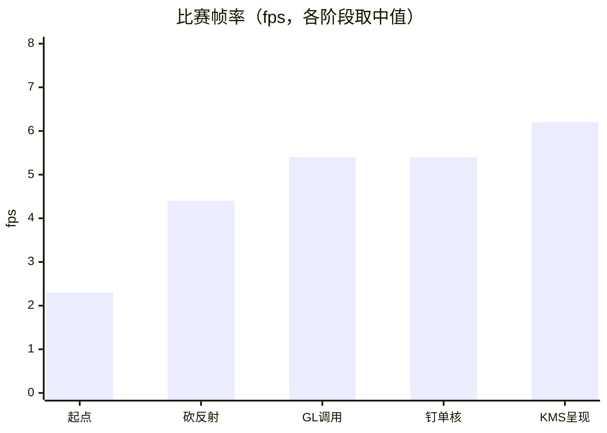
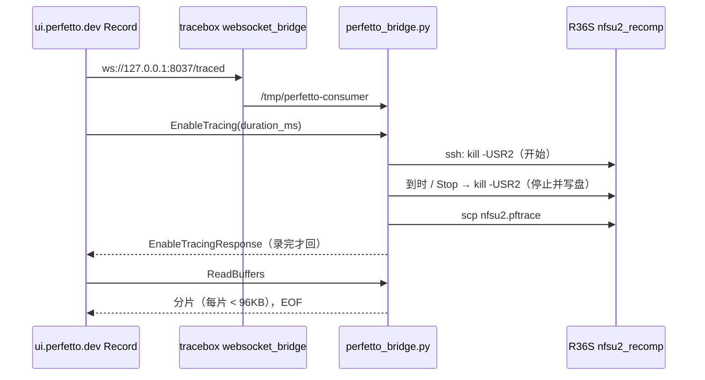
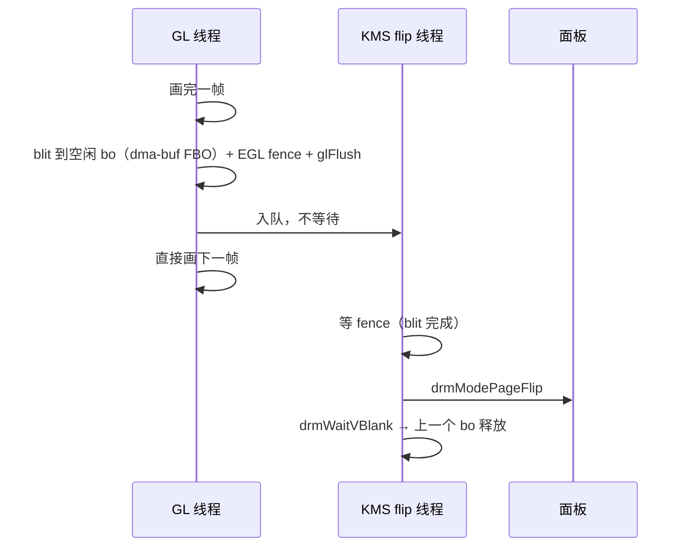
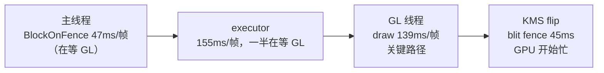

# 04 - R36S 性能突破复盘：从 1.6fps 到 6fps

> 日期：2026-10-05。数据均为真机实测，同时记录了频率和温度。标 *（估）* 的是推算值。
> 前置文档：[02 性能分析与优化方案](02-R36S性能分析与优化方案.md)（瓶颈分析、覆盖率 §10、GL 调用 §11）、[03 同类项目对比](03-同类项目对比与可借鉴方案.md)（LTO、去 volatile 无效的原因）。
> 设备：R36S，RK3326（4× A35，温控后 1008MHz），Mali-G31（blob r13p0），内核 4.4，dArkOS。

## 1. 结果

| 阶段 | 比赛帧率 | 每帧时间 | 关键变化 | 提交 |
|---|---|---|---|---|
| 起点（docs/02 §1） | 1.6-3.0 | 340-500ms | GL 驱动调用、音频模拟 | `71ab10f` |
| 去冗余 FBO/viewport 绑定，跳过反射 | 3.7-5.1 | ~230ms | 每帧少约 230 次 draw | `55bb5e5` |
| LTO / 去 volatile / PGO | 持平 | — | **无效**（docs/03 §8） | `1fc7034` |
| GL 调用削减 | 4.1-4.8 → **5.0-5.8** | ~175ms | 每次 draw 的调用 18 → 7 | `516be15` |
| guest 钉单核 | **5.0-5.7**（同场景更稳） | 175 → **137ms** | 主线程 GIL 等待 76 → 0.1ms/帧 | 本次 |
| KMS page flip 呈现 | **5.9-6.5** | 约 155ms，场景 draw 多 80% | GL 线程不再阻塞在 swap，36 → 1ms | 本次 |



累计约提升 **2.7 倍**。另外两点：卡顿明显减少，"钉单核"这一步体感改善最大；画面和音频始终正确。

## 2. 方法：先测量，再动手

几次真正的突破都靠新的观测手段，而不是凭直觉改代码。

| 工具 | 回答的问题 | 位置 |
|---|---|---|
| perf 按线程归属 | CPU 花在哪 | docs/02 §3 |
| 覆盖率插桩（`NFSU2_PGO=gen` + SIGUSR1 导出） | 一局比赛跑到了哪些函数 | docs/02 §10、`r36s/pgo_report.py` |
| GL 调用计数（`RECOMP_GL_CALL_STATS=1`） | 每次 draw 调了哪些 GL 函数 | docs/02 §11 |
| **xtrace 时间线**（Perfetto） | **谁在等谁**，每一帧的关键路径 | §3 |

perf 统计只能看出"CPU 忙在哪"。帧率被卡住，往往是因为线程之间在互相等待，perf 统计看不出来，而且容易被噪声误导。xtrace 补上了这一块。

## 3. xtrace：游戏内时间线和 Perfetto Record 桥

### 3.1 埋点模块

`xboxrecomp/src/platform/xtrace.c`：

- 每个线程有自己的事件缓冲区，每个事件 16 字节，记录时不加锁，缓冲满了就丢弃并计数；
- 直接输出 Perfetto 原生 protobuf（`.pftrace`），名字做了 intern，平均每个事件约 20 字节，10 秒约 5-10MB；
- 没启用时，每个埋点只是一次读加一次分支。启用方式是 `RECOMP_TRACE=<路径>`，再用 `kill -USR2` 开始或停止。文件先写 `.tmp`，写完再 rename。

埋点只放在线程之间互相等待的地方，没有做自动插桩。理由：一局比赛的 lifted 函数调用超过 1 亿次，自动插桩会拖慢 A35，还会改变线程之间的等待关系。

| 线程 | 区间 |
|---|---|
| game main | `frame`、`frame fence` / `BlockOnFence`、`GIL wait`、各个内核调用 `k:*` |
| guest worker（按 `入口:context1` 命名） | `GIL wait`、`k:KeDelayExecutionThread` 等 |
| executor | `pb exec`、`wait GL (…)`、`idle` |
| GL | `draw`（内含 `tex upload` / `tex check` / `prog compile`）、`clear`、`flip`、`KMS blit`、`queue empty` |
| KMS flip | `blit fence`、`page flip`、`vblank` |
| apu / timer/DPC | `apu vp`、`apu dsp+out`、`vblank+irq+DPC`、`idle` |

### 3.2 Perfetto UI 一键录制

`r36s/perfetto_bridge.py` 伪装成 traced，实现了 Consumer IPC 协议，做法照搬 `cortrace/scripts/perfetto_record_bridge.py`：



几个协议要点（cortrace docs/03 §8.2）：EnableTracing 的回复必须等录完才发；IPC 每帧最大 128KB，数据要分片；同一时间只允许一个录制。设备那边由 `env.txt` 设置 `RECOMP_TRACE` 和 `RECOMP_TRACE_SECS=0`。

## 4. 突破一：GL 调用削减（每次 draw 18 → 7）

调用计数发现，每次 draw 的 18 个 GL 调用里，约 11 个是冗余的：

| 调用 | 每次 draw | 处理 |
|---|---|---|
| `glActiveTexture` | 4.0 | 只在某个纹理单元的绑定真的变化时才切换（`bind_unit`） |
| `glBindBuffer` ×2、`glBindVertexArray` | 3.0 | 缓存绑定状态（全局只有一个 VAO、一对 ring） |
| `glMapBufferRange` + `glUnmapBuffer` ×2 | 4.0 | 持久映射 ring：`GL_EXT_buffer_storage`，coherent，分 4 段，用 fence 保护 |

结果：GL 线程占用 82% → 47%，帧率 +20%。这一步之后，GL 线程**不再是唯一的瓶颈**。

## 5. 突破二：guest 钉单核（GIL 等待 76 → 0.1ms）

### 5.1 现象

xtrace 显示，主线程每帧要**等 GIL 76ms**，11 秒里等了 2.8 万次。timer/DPC 每次持锁 2.4ms，且不可被抢占。

### 5.2 GIL 是什么，原机上有没有

Xbox 和 GameCube 都**只有一个 CPU**，EA 的代码是按"同一时刻只有一个线程在跑"写的：存在不加锁的读改写，也存在先填数据、别的线程才去读的时序依赖。重编译后每个 guest 线程都是真正的 host 线程，在 4 核上会真并行，结果读到了还没填好的内存（`0xAAAAAAAA` 当指针），直接崩溃（CLAUDE.md）。

GIL 规定同一时刻只有一个线程跑 lifted 代码，相当于在用户态模拟"单 CPU"。原机上没有 GIL，但原机的单核天然就保证了这一点，而且线程切换只要几微秒。我们的锁交接要经过 futex、cond_broadcast，再等 host 调度器把线程唤醒，一次要几十到几百微秒，又分散在 4 个核上，cache 是冷的。

### 5.3 做法

guest 线程本来就是串行执行的，没必要分散到 4 个核上，那就干脆把它们都放到同一个核上：

| core 3（guest，等同原机 CPU） | core 0-2（运行时，等同原机的专用硬件） |
|---|---|
| 游戏主线程、EA 混音、流加载 worker、timer/DPC、OHCI ISR | GL（NV2A）、executor（NV2A 前端）、APU（MCPX）、SDL 音频、Mali 驱动线程 |

上游已有 `RECOMP_GUEST_ONE_CORE` 开关，但它在 Linux 上实际不可用：

- **第一次实验**帧率反而掉到 1.5-2.2fps。原因是 affinity 会被继承：启动线程先把自己钉到 core 3，之后创建的 GL、executor、APU、SDL、Mali 线程全都继承了这个 mask，整个进程被挤到一个核上（`pb exec` 单次从 4ms 涨到 261ms）。
- **修复**（`win32_compat.c`、`main.c`）：在 Linux 上实现 `xbox_nx_spread_thread`，让运行时线程启动时离开 guest 核；启动线程在进入游戏代码之前才钉回 guest 核。之后逐个线程核对了 affinity。

### 5.4 结果（同一份 trace 对比，1008MHz）

| 指标 | 前 | 后 |
|---|---|---|
| 主线程 GIL 等待 | 76ms/帧 | **0.1ms/帧** |
| 全进程 GIL 等待 | 17.4s / 11s | 1.9s / 9s |
| `vblank+irq+DPC` 单次 | 2.4ms | 0.21ms |
| 每帧时间 | 175ms | **137ms** |

**教训**：用 GIL 保证正确性的同时，也把调度成本带了进来。把真并行改回"单核加专用硬件"这个原机模型，切换成本就回到了合理水平。启动脚本已经默认开启 `RECOMP_GUEST_ONE_CORE=1`。

## 6. 突破三：KMS page flip 呈现（三缓冲）

### 6.1 现象

GIL 的问题解决后，xtrace 显示 GL 线程成了关键路径，每帧要忙 128ms，其中 **36ms 阻塞在 `SDL_GL_SwapWindow`**。原因和 reVC docs/08 §7 一样：Mali blob 的窗口 surface 是双缓冲，swap 要等上一帧 GPU 做完才把缓冲区还回来。缓冲区数量由驱动决定，应用侧改不了。

### 6.2 做法（`xboxrecomp/src/nv2a_gl/kms_present.c`）

不再使用 blob 的窗口 surface，改为自己管理一条 scanout 链：



- 3 个 gbm bo，用 `drmModeAddFB` 加为 framebuffer，再通过 `EGL_EXT_image_dma_buf_import` 导入成 FBO。实测 3 个都能导入；reVC 当时第 3 个导入失败了。
- drm、gbm、EGL 全部用 dlopen 加载（交叉编译镜像里没有这些头文件），结构体按设备上的头文件手写。
- 照搬了 reVC 踩过的坑：用 SDL 自己的 drm fd（它是 master）；不用 AddFB2，在 blob 上会挂住；不用 flip 事件，会被 SDL 抢走；不用 ASYNC，返回 EINVAL。
- 比 reVC 简单的地方：只有一个 GL context，blit 直接在 GL 线程上做，没有跨 context 共享 FBO 的问题。
- **画面方向**：bo 的第 0 行就是扫描输出的第一行，surface 也是按从上到下存行，所以**直接 blit，不翻转**。第一次照搬窗口路径的翻转，画面上下颠倒；第二次又误加了 x 镜像，左右反了。这一点不能套用窗口路径的经验。`RECOMP_KMS_FLIPX/Y` 可以按轴覆盖。
- 开关是 `RECOMP_KMS_PRESENT=1`，启动脚本已默认开启。任何一步失败都会自动退回 swap。

### 6.3 结果（1008MHz，84℃）

| 指标 | 前 | 后 |
|---|---|---|
| GL 线程在 swap/flip 上的耗时 | 38ms/帧 | **1.2ms/帧** |
| 日志帧率 | 5.0-5.7 | **5.9-6.5** |
| 每次 draw 平均耗时 | 89µs | 85µs |

这份 trace 录到的场景，每帧 draw 数比上一份多约 80%（1630 对比 975），所以帧时间没法直接比，但每次 draw 的耗时基本没变，日志帧率也提高了。**跨 trace 比较时，要注意场景负载可能不同**，最好固定同一段路线。

## 7. 走过的弯路（同样是结论）

| 尝试 | 结果 | 原因 |
|---|---|---|
| LTO、去 volatile、PGO | 无收益 | 损失来自源 ISA 的生成代码形态（x86 栈传参、x87），构建层面去不掉（docs/03） |
| 按尺寸跳过 320x240 的 pass | 画面发蓝、卡死 | 误伤了后处理，改成按 draw 数判断（`RECOMP_GL_SKIP_MIN`） |
| `NFSU2_APU=0` | 开场视频卡死 | 视频是按 APU 时钟推进的 |
| 第一次钉单核 | 帧率 ÷3 | affinity 被继承（§5.3） |
| 重写热点游戏函数 | 暂不做 | 覆盖率加 perf 显示，lifted 游戏代码前 21 个函数只占全进程约 10%（docs/02 §10） |
| 在 VM 上测性能 | 结论无效 | VM 比真机还慢，测性能一律用真机 |

## 8. 当前瓶颈与下一步

最新 trace（KMS 呈现之后）：



| # | 方向 | 依据 | 预期 |
|---|---|---|---|
| 1 | 诊断慢 draw：给大于 200µs 的 draw 记顶点数、索引数、目标尺寸 | 2949 个慢 draw 共 1.28s，其中纹理和 shader **只占 46ms**，大头原因未知 | 先定位 |
| 2 | 顶点格式 / VAO 缓存 | 每次 draw 还有约 3 次 `glVertexAttribPointer` | GL 线程 -5~10% *（估）* |
| 3 | uniform 合并上传 | 每次 draw 约 1.8 次 `glUniform4fv`，外加零散调用 | 同上 |
| 4 | 降低内部分辨率（`RECOMP_GL_SCALE`） | `blit fence` 45ms，GPU 已开始成为瓶颈 | 待测 |
| 5 | 原生 EA 混音器 | APU 加 EA 混音占掉 0-2 核里的近一个核 | 释放运行时核 |
| 6 | DXT 改用离线 ASTC | 纹理上传在长尾里占比很小 | **降级** |

## 9. 复现

```sh
# 构建与部署
sg docker -c 'bash r36s/build.sh'
sshpass -p ark scp build-r36s/nfsu2_recomp ark@192.168.3.71:/roms/ports/nfs8/nfsu2_recomp.new
# 时间线：在本机启动桥，浏览器打开 ui.perfetto.dev -> Record new trace -> Linux -> WebSocket -> Start
python3 r36s/perfetto_bridge.py          # trace 保存在 build-r36s/trace/
# 统计：trace_processor（pip 包 perfetto 自带的 prebuilt）
```

| 开关 | 默认 | 作用 |
|---|---|---|
| `RECOMP_GUEST_ONE_CORE=1` | 启动脚本开启 | guest 线程放在最后一个核，运行时线程避开它 |
| `RECOMP_KMS_PRESENT=1` | 启动脚本开启 | 用 page flip 呈现；`RECOMP_KMS_BOS`、`RECOMP_KMS_FLIPX/Y` |
| `RECOMP_GL_PERSIST=0` | 关（即持久 ring 开） | 关掉持久映射 ring |
| `RECOMP_GL_CALL_STATS=1` | 关 | 每 300 帧输出一次 GL 调用统计和 swap 时间 |
| `RECOMP_TRACE=<路径>` | env.txt 里开启 | xtrace，配合 `RECOMP_TRACE_SECS`、`RECOMP_TRACE_START` |
