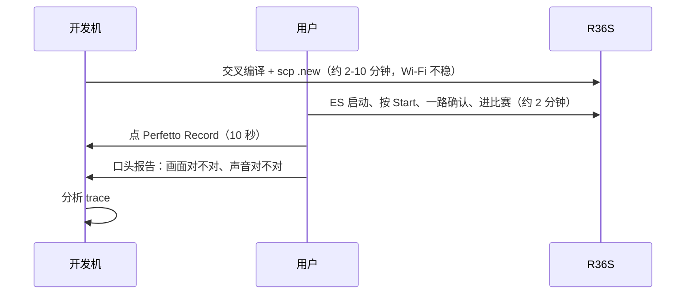
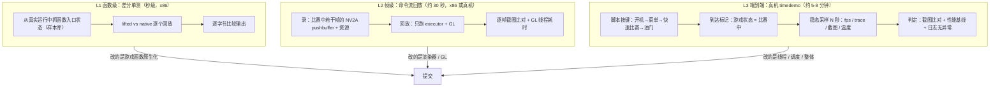
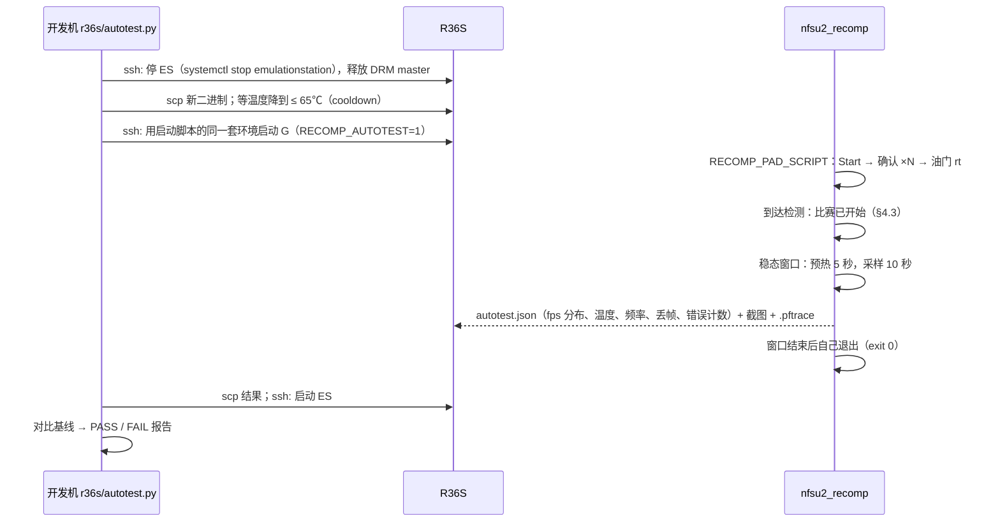
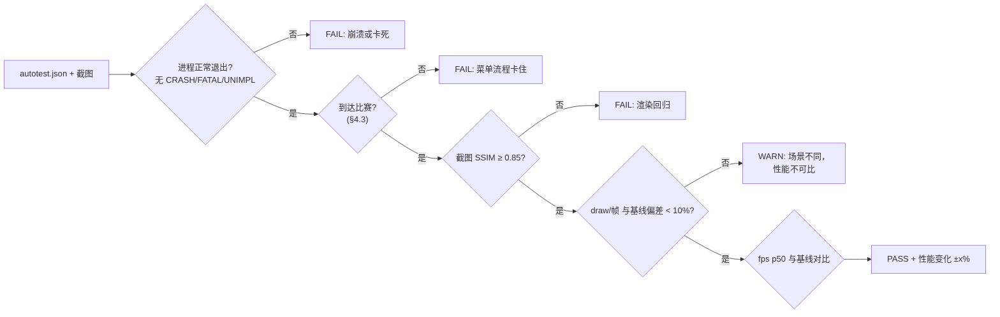
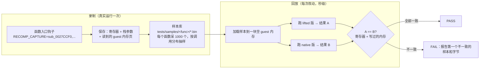
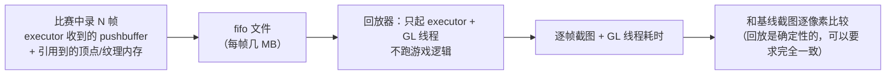
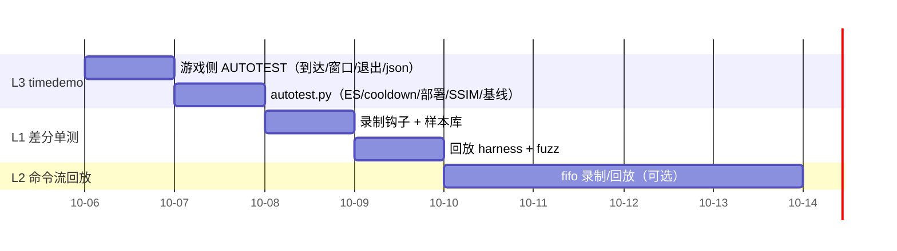

# 05 - 自动化验证流水线设计：一键进比赛、抓数据、判对错

> 状态：设计 v1（2026-10-05）。标 *（估）* 的是推算值，标 ✅ 的是仓库里已有的能力。
> 前置文档：[02 性能分析](02-R36S性能分析与优化方案.md)、[04 性能突破复盘](04-R36S性能突破复盘.md)。
> 目标：每次改完代码，**不用人工操作**就能拿到三样东西：性能数字、trace、画面是否正确的判断。把现在"编译 → 部署 → 人进比赛 → 人点 Record → 人看画面"这个以小时计的循环，压到 10 分钟以内的一条命令。

## 1. 现状与问题

现在的循环：

问题：

| 问题 | 后果 |
|---|---|
| 每轮都要人参与 | 一天只能迭代几轮，而且要两个人同时在场 |
| **场景不固定** | 这次 905 个 draw/帧，上次 1258 个，**帧率没法直接比**（docs/04 §6.3） |
| 温度不受控 | 同一个二进制，70℃ 和 88℃ 下的频率不同（1200 vs 1008MHz） |
| "画面对不对"全靠人看 | 只能发现明显的错误，像素级的细微回归会漏掉 |
| trace 会丢事件 | 缓冲区满了没人知道，事后才发现数据不完整 |

## 2. 业界做法

同类项目的端到端验证，大致分四层：

| 层 | 代表项目 | 做法 | 判对错的依据 |
|---|---|---|---|
| **指令级差分** | 本仓库的 `xboxrecomp/tools/conformance` ✅、RecompCore lockstep、Dolphin 的 FifoCI | 同一段输入，参考实现和被测实现各跑一遍，比较 CPU 状态 | 参考实现就是 oracle |
| **函数级差分** | 本仓库的 `RECOMP_NATIVE_CHECK` ✅、decomp 项目的 objdiff | 原生替换和 lifted 版本对同一个输入各跑一次，逐字节比较输出 | lifted 版本就是 oracle |
| **帧级回放** | Dolphin FifoCI（录 GPU 命令流 → 回放 → 截图比对）、apitrace、RenderDoc capture | 录下某一帧的 API 调用流，离线回放，和基准截图做差 | 基准截图 |
| **端到端 TAS 回放** | 模拟器社区的 TAS movie（BizHawk、Dolphin `.dtm`）、各类 PC 移植的 demo 回放（re3、Quake 的 `timedemo`） | 固定输入序列 + 固定随机种子，从开机一路跑到指定场景，记录帧率和截图 | 基准截图 + 性能基线 |

几个关键点：

- **Dolphin FifoCI** 是图形回归测试的标杆：每个 commit 都回放一组固定的 GPU 命令流，自动截图，和上一版比较。不一致的帧会出现在网页上，由人确认是修复还是回归。
- **Quake/re3 的 timedemo**：录一段 demo，回放时不限速，跑完输出平均帧率。**场景完全固定**，所以性能数字可以直接比较。这正是我们缺的。
- **确定性是前提**：要让同一段输入每次都走到同一个场景，就得控制随机种子、时间源和异步加载。完全做不到时，就退一步：**固定场景，加上容忍度**。

## 3. 总体设计

分三档。越往下越快，覆盖面越窄：

按改动类型选档位：

| 改动 | 用哪档 | 原因 |
|---|---|---|
| 游戏函数原生化（混音、剔除） | **L1**，可选 L3 | 正确性可以精确判断；性能看 L3 |
| 渲染器 / GL 调用 / KMS | **L2**，加 L3 | 画面正确性和 GL 线程耗时，都能用固定命令流测 |
| 线程、调度、GIL、钉核 | **L3** | 只能在真实运行里看出来 |
| 编译选项（LTO、PGO） | L3 | 看整体性能 |

## 4. L3：真机 timedemo（最先做，收益最大）

### 4.1 流程

### 4.2 输入：按键脚本 ✅

`RECOMP_PAD_SCRIPT` 已经实现（`usb_gamepad.c`）：

- 每一步写成 `毫秒:按键:按住毫秒`；
- 时间从游戏第一次读手柄算起，开机时间的抖动不会让脚本错位；
- 支持模拟键 `rt`（油门全开）。

需要补两点：

| 补充 | 原因 |
|---|---|
| **长按**：`rt` 按住几十秒（hold 可以设大，已经支持） | 比赛中要一直踩油门 |
| **步骤之间按条件等待**，而不只是按时间等 | 菜单加载时间受 SD 卡和温度影响，固定延时有时会早、有时会晚。改成"等到某个标记再继续"（§4.3） |

最简单的版本是**纯时间脚本，每一步留足余量**。比如每次确认间隔 3 秒，慢一点但很稳。开场视频可以靠按 Start 跳过。

### 4.3 到达检测：怎么知道已经在比赛中

按可靠程度排序：

| 方法 | 做法 | 优点 / 缺点 |
|---|---|---|
| **a. 渲染指纹** ✅（数据已有） | `RECOMP_GL_SURF_STATS` 已经在统计每帧画到哪些 surface。比赛中会出现 128x128 ×6（环境贴图）加 320x240（反射），菜单里没有 | 零逆向，现在就能用。缺点：别的场景也可能有同样的 pass |
| **b. 游戏状态变量** | 找到游戏的"当前模式/状态"全局变量。GC 符号里有 `GameFlowManager` 这一类状态机，可以用和 RAINDROP 一样的方法定位到 Xbox 地址 | 最准确。约半天逆向 |
| **c. 帧率特征** | draw 数稳定在 800 以上，并持续 3 秒 | 粗糙，只适合当兜底 |

先用 **a+c**，做完 b 再替换。

### 4.4 稳态采样：可比的性能数字

| 措施 | 解决什么 |
|---|---|
| 启动前 **cooldown 到 65℃ 以下** | 每次起始温度一致 |
| 设定**稳态窗口**：到达后先预热 5 秒，再采样 10 秒 | 避开开场的纹理上传和 shader 编译 |
| 报告 **fps 的 p50 / p10 / p1**、帧时间直方图，以及每帧 draw 数 | 用 draw 数判断场景是否一致（偏差超过 10% 就判为无效样本，不进比较） |
| 报告 CPU 频率和温度曲线 | 区分是降频还是代码变慢 |
| 每档跑 **3 次取中位数** | R36S 噪声大，单次结果不可靠 |
| xtrace 自动在窗口内录 5 秒，**丢事件数 > 0 时警告** | 防止 trace 不完整 |

### 4.5 正确性：截图比对

- 稳态窗口里每秒截一次图（`RECOMP_GL_DUMP` ✅ 已有，写 BMP），和基线比 **PSNR 或 SSIM**。
- 比赛中有车流和粒子，画面不是逐像素确定的。所以不做逐像素比较，只**判断是不是同一类画面**：SSIM ≥ 0.85 视为正常。全黑、全蓝、花屏、上下颠倒这类回归，SSIM 会掉到 0.3 以下。
- 这一招专门用来发现 §6 里列出的那种回归（发蓝、上下颠倒、黑屏）。

### 4.6 判定与报告

报告输出到 `build-r36s/autotest/<时间>/`：`report.md`、截图、trace、原始 json。

### 4.7 防卡死

- 设一个总超时（例如 5 分钟），到点就 `kill -9`。卡死本身也算一种结果，报告里会附上日志尾部。
- 游戏内的看门狗 `xbox_WatchdogStart` ✅ 已有，卡住时会打印出来。

### 4.8 工作量

| 项 | 工作量 |
|---|---|
| 游戏侧 `RECOMP_AUTOTEST`：到达检测（a+c）、稳态窗口统计、窗口结束自动退出、输出 json | 0.5 天 |
| 摸索按键序列（菜单要按几次、等多久） | 0.5 天（需要用户配合一次，之后就固定下来） |
| `r36s/autotest.py`：停 ES、cooldown、部署、启动、收集结果、SSIM、对基线、出报告 | 1 天 |
| **合计** | **约 2 天** |

## 5. L1：函数级差分单测（最快，适合原生化）

### 5.1 为什么够用

lifted 代码本身就是 oracle。原生替换一个函数之后，只要**在所有真实输入下，输出都和 lifted 版逐字节一致**，就可以放心换。现在的 `RECOMP_NATIVE_CHECK` ✅ 已经在做这件事，但它只能在游戏运行时在线比对：要先跑起来、等到对应场景，覆盖率也取决于这一局玩了什么。

### 5.2 设计：录制样本 → 离线回放

几个要点：

- **只录读到的内存**：给 `MEM*` 访问加一个录制模式（只在录制版本里开），记下函数执行期间读过的页。混音这类叶子函数通常只读两个缓冲区，每个样本几 KB。
- **样本有代表性**：按调用次数均匀抽样，另外**额外保留边界值**，比如长度为 0、长度不是 16 的倍数、指针未对齐、跨 4GB 回绕。
- **fuzz 扩展**：在真实样本的基础上随机扰动输入（浮点值、长度、对齐），覆盖游戏里没出现过的情况。这正是论文 *When LLM Decompilers Recompile More and Preserve Less* 里 Decompile-Diverge 的做法：只靠"能编译、能过已有测试"的验证会漏掉 5% 左右的行为差异。
- **在 x86 上跑**：lifted 代码和 native 代码都能在本机编译，测试在 ctest 里秒级完成，不需要真机。
- **补充测试 aarch64 编译器行为**：FMA 合并（`fmadd`）这类问题只在 aarch64 上出现。可以在交叉编译镜像里用 qemu-user 跑同一组用例，几秒钟就够。

### 5.3 和现有 conformance 工具的关系

`xboxrecomp/tools/conformance` ✅ 测的是**单条指令**的 lifter 正确性：在真 x86 CPU 上跑汇编片段，和 lifted C 的结果比较。L1 测的是**整个函数**的原生替换。两者互补：

| | conformance（已有） | L1 函数差分（新） |
|---|---|---|
| 对象 | lifter 翻译单条指令 | 人写的原生函数 |
| oracle | 真 x86 CPU | lifted C |
| 输入 | 手写用例加 fuzz | 真实运行录下的样本加 fuzz |

### 5.4 工作量

| 项 | 工作量 |
|---|---|
| 录制钩子：入口状态加读集 → 样本文件 | 1 天 |
| 回放 harness：x86 单元测试，加进 ctest | 0.5 天 |
| fuzz 扩展 | 0.5 天 |
| **合计** | **约 2 天**。之后每原生化一个函数，只要录一次样本，验证是秒级 |

## 6. L2：命令流回放（渲染回归）

借鉴 Dolphin FifoCI 和 apitrace：

- 回放跳过了游戏逻辑，所以**完全确定**，截图可以要求逐像素一致，比 L3 的 SSIM 严格得多。
- 它也是 **GL 优化的性能基准**：GL 线程每帧耗时不受主线程影响。之前讨论的 VAO 缓存、uniform 合并，都可以在这里直接测出收益。
- 难点在于怎么判定"引用到的内存"：pushbuffer 里的顶点和纹理地址指向 guest RAM。最省事的办法是**直接把整个 64MB guest RAM 的快照存下来**，按帧只记增量。
- 工作量：**约 3-4 天**。L3 和 L1 做完以后再考虑。

## 7. 推荐顺序与收益

| 档位 | 一次验证耗时 | 需要人吗 | 适用 |
|---|---|---|---|
| 现在 | 15-30 分钟 | 需要 | 一切 |
| L3 | 5-8 分钟 *（估）* | 不需要 | 整体性能、线程、崩溃、明显的渲染回归 |
| L1 | 秒级 | 不需要 | 每个原生化函数的正确性 |
| L2 | 约 30 秒 *（估）* | 不需要 | 渲染器正确性、GL 侧性能 |

**建议先做 L3**。它直接替代人工流程，同时解决"场景不固定、温度不受控"这两个让性能对比失真的根本问题。接下来要原生化剩下的混音函数时，再做 L1。

## 8. 风险

| 风险 | 对策 |
|---|---|
| 游戏有随机性（AI、车流），每次进比赛的场景略有差异 | 固定赛道和模式（快速比赛、同一赛道），用 draw 数判断样本是否有效；取 3 次中位数 |
| 停掉 ES 以后设备没有界面 | 脚本退出时（包括异常退出，用 trap）一定重新启动 ES |
| 存档状态影响菜单流程（第一次进入时有教程） | 测试用一份固定存档（`save-autotest/`），每次运行前恢复 |
| 截图会读回 GPU 数据，影响性能 | 只在稳态窗口之后截图，不放在采样窗口内 |
| Wi-Fi 不稳 | 二进制先 gzip 再传（13MB），结果在设备上压缩后再拉回 |
