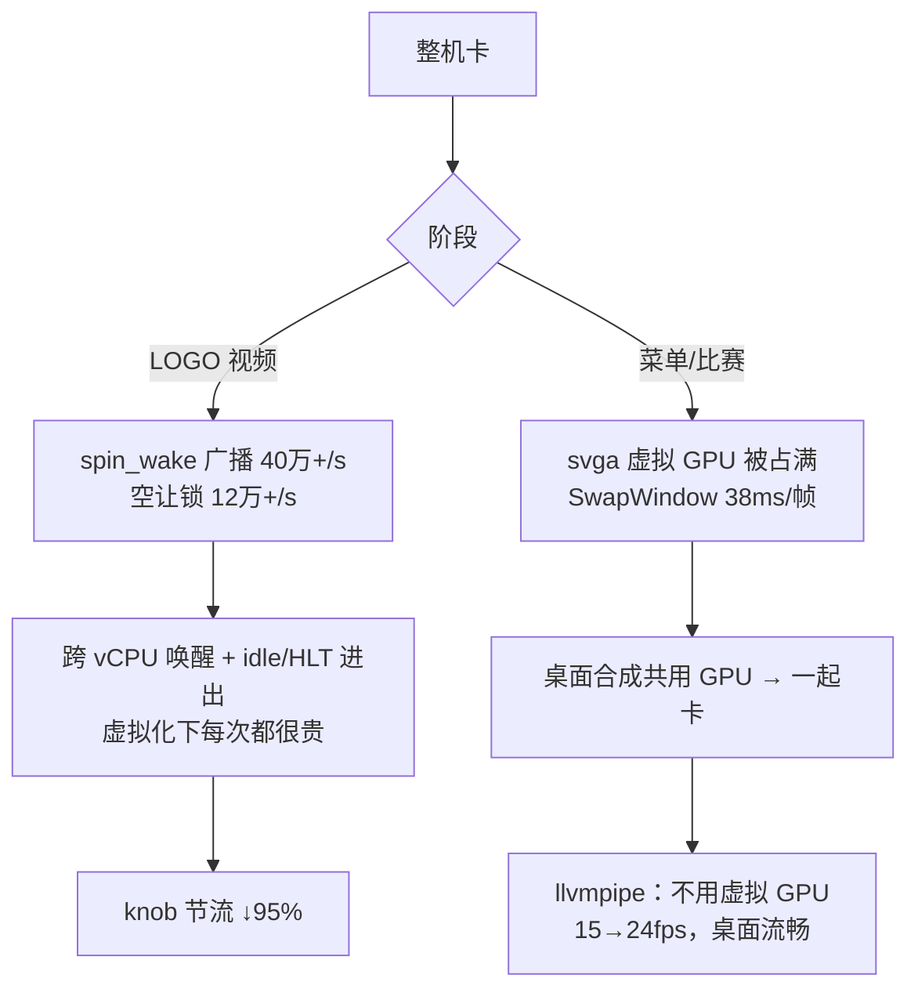

# 06 - PC 虚拟机整机卡顿：根因与对策

> 日期：2026-10-06（10-05 初版的若干结论已被推翻，见 §6）。环境：VMware Workstation 12.5 / i7-11800H，guest Ubuntu 24.04（16 vCPU、9.9GB），Mesa 25.2 svga（`SVGA3D; LLVM`）。
> 目标：让 PC 虚拟机能做快速回归（L1/L2、画面对比），**不是**提升真机性能。真机收益估计在 1% 量级（§5）。

## 1. 结论

整机卡顿分两个阶段，原因也不同：

| 阶段 | 根因 | 证据 | 对策 |
|---|---|---|---|
| LOGO 视频 | **唤醒风暴**：游戏在 APU 时钟上 spin，`RECOMP_SPIN_HINT` 每 16 圈调一次 `recomp_spin_wake`，广播唤醒 `nv2a flags` 线程；每 64 圈让一次 GIL，但这时根本没人排队 | `[wake]` 计数：bcast 40万–89万/s，yield_real 12万–24万/s | knob `SPIN_WAKE_EVERY=64` 和 `SPIN_YIELD_IDLE=1`，各降约 95–98% |
| 菜单 / 比赛 | **虚拟 GPU 被占满**：svga 的 GPU 很慢（GLX 报 `Accelerated: no`），游戏不限帧，把它占满；桌面合成器和 IDE 共用同一块虚拟 GPU，被拖慢 | 游戏 CPU 只占约 10%；`executor` 有 70% 的时间停在 `dma_fence_default_wait`；trace 里 SwapWindow 平均 38ms/帧，而所有 draw 的 CPU 时间加起来只有约 0.15ms | **改走 llvmpipe 软件渲染**：菜单 15→24fps，桌面流畅（用户确认）。限帧也有效但只是止痛 |

## 2. 机制更正：贵的是"唤醒"，不是 syscall

初版说"每个 syscall 都是一次 vmexit"，**这是错的**。VT-x 下，futex 和 sched_yield 在 guest 内核里就处理完了，不会退出到 hypervisor。在虚拟化下真正贵的是两件事：

- **跨 vCPU 唤醒**：futex wake 要唤醒一个睡在别的 vCPU 上的线程，就得发 IPI。如果那个 vCPU 正在 HLT，hypervisor 还得先把它调度回来。
- **频繁进出 idle**：vCPU 每次睡下（HLT → VMEXIT）再被唤醒，都要切换 FPU 状态、走一遍 host 调度。

这是 KVM 社区讲过多次的 message-passing 负载问题，参见 [KVM Forum 2013 idle latency](https://linux-kvm.org/images/2/27/Kvm-forum-2013-idle-latency.pdf)；[KVM Forum 2015](https://docs.huihoo.com/kvm/kvm-forum/2015/KVM-Message-Passing-Performance.pdf) 测得 Windows Event 的唤醒延迟是裸机的 3–4 倍。KVM 的解决办法是 [halt-polling](https://dri.freedesktop.org/docs/drm/virt/kvm/halt-polling.html)，但 VMware Workstation 没有提供这个开关，只能从程序这一侧减少唤醒。

`perf -a` 看到 `swapper 97%`，16 线程抢锁的小程序却"不卡"，这两件事并不矛盾。小程序的线程大多一直睡着，很少被唤醒；nfsu2 在视频阶段每秒有几十万次"叫醒一个没事可做的线程"。

## 3. 唤醒源与节流（LOGO 阶段）

| 计数（`[wake]`，/s） | 默认 | `SPIN_WAKE_EVERY=64` | + `SPIN_YIELD_IDLE=1` |
|---|---|---|---|
| `bcast`（spin_wake 真正广播） | 40万–89万 | 约 9000 | 约 9000 |
| `yield_real`（真正让出 GIL） | 12万–24万 | 约 15万 | **约 7000** |
| fps | 约 43 | 不变 | 不变 |

- `SPIN_WAKE_EVERY=n`：每 n 次 `recomp_spin_wake` 才真广播一次。`spin_ack_flush`（kickoff 的 write-combine 应答）仍然每次都执行，所以 kickoff 不会变慢。
- `SPIN_YIELD_IDLE=1`：没有其他线程排队等 GIL 时，跳过 unlock、yield、relock 这三步。有人排队时照常让出，不增加等待延迟。这正是 CPython `gil_drop_request` 的思路：按需交出锁，而不是定时交出（[bpo-7946](https://bugs.python.org/issue7946)）。
- `recomp_preempt` 不受节流影响。初版补丁把它和 spin_yield 共用一个计数，连 `RECOMP_GIL_EAGER` 的优先级让锁也一起节流了，已经修正。

## 4. 虚拟 GPU（菜单阶段）

先在同一个菜单场景下排除了几个怀疑点（`build/gpuab.sh`，每组 15 秒）：

| 组 | 菜单 fps | executor 等 fence |
|---|---|---|
| 默认（svga，x11/XWayland） | 14.5 | 70% |
| `RECOMP_GL_PERSIST=0` | 14.9 | 70% |
| `RECOMP_GL_THREAD=1` | 15.0 | 91% |
| `RECOMP_GL_SCALE=0.5` | 15.3 | 75% |
| R36S 组合（GL 线程 + GIL_EAGER + GL_SKIP） | 15.4 | 98% |
| `SDL_VIDEODRIVER=wayland` | 14.1 | 64% |
| `vblank_mode=0` | 14.9 | 71% |
| **llvmpipe（`LIBGL_ALWAYS_SOFTWARE=1`）** | **23.9** | 0% |

- 持久映射、GL 线程、分辨率减半、呈现后端，**都没有明显影响**。说明瓶颈不在某一种 GL 用法上，而是 svga 每帧的固定开销。
- GALLIUM_HUD 看到的 svga 计数：没有 fallback，也没有 readback；每帧 1 次 flush，约 20 个 draw，上传约 1.35MB（顶点约 620KB）。都不算异常。
- 对照：同一个 VM 上，`/tmp/swap_bench` 每帧只有 0.9ms，glmark2 也正常。说明 svga 处理简单负载没问题，是游戏这类负载（每帧大量小 draw、shader 很多、FBO 互相交叉）在 VMware 的 host 侧翻译代价高。具体是 host 侧哪一步慢，我们从 guest 里看不到。
- 选 llvmpipe 的理由：它完全不碰虚拟 GPU，桌面合成器保住了；16 个 vCPU 跑软件光栅化反而更快；画面亮度统计和 svga 一致（帧转储的 mean/std 接近），正确性回归可以用。

## 5. 对真机的影响

- knob 的默认值就是原来的行为。真机不开 knob，二进制行为不变。
- 即使在真机上打开 `SPIN_YIELD_IDLE`，收益也有限。真机 trace（`trace/linux-202691-203450.pftrace`，11 秒 96 帧）显示：主线程 GIL 等待为 0 次，所有内核调用合计约 70ms，占 0.6%；非主线程被 1ms 超时打断，估计占 core 3 的 0.5–1%。真机提速仍然要靠原生化热点函数和减少 draw。

## 6. 初版被推翻的结论

| 初版说法 | 更正 |
|---|---|
| 每个 syscall 一次 vmexit | 不对，见 §2。贵的是跨 vCPU 唤醒和 idle 进出 |
| 堆地址 futex 是 `KeWaitForSingleObject` 的 1ms 轮询 | `kdisp_wait` 的切片是 4ms；1ms 超时是 GIL 等待（`gil_lock`）。所有 CV 都是 `cv_lazy_init` malloc 出来的，都在堆上 |
| nfsmw-nx 用纤程调度，所以没有这个问题 | 不对。ReXGlue 的每个 XThread 都是真 host 线程（`pthread_create`）。`fiber_switch.cpp` 只是在实现游戏自己调用的 Win32 Fiber API。它不需要 GIL，是因为 360 上的游戏本来就是按多核写的 |
| `RECOMP_SPIN_YIELD_N` 是最合理的补丁 | 它是盲目节流，还误伤了 preempt。已回退，换成按需让锁（`SPIN_YIELD_IDLE`） |
| 菜单卡也是 spin 风暴 | 菜单阶段的唤醒已经很少，卡是因为虚拟 GPU 被占满（§4） |

## 7. 工具（只启动一次就能诊断）

- **`[wake]` 计数**（`xboxrecomp/src/platform/knobs.{c,h}`）：每秒往日志打一行，同时写成 xtrace counter，可在 Perfetto 里看曲线。计数项：spin_wake/bcast、hw_sleep/hw_tmo/hw_yield、yield/yield_real、gil_wait/gil_tmo、kdisp、上传量（up_vtx_kb/up_idx_kb/up_tex_kb/up_tex_n）。
- **在线调参**：游戏每秒重读一次 `/tmp/nfsu2.knobs`。`RECOMP_KNOBS=<路径>` 可以换文件；`=0` 关闭这个线程，只保留环境变量设的默认值；`RECOMP_KNOBS_QUIET=1` 不打印 `[wake]`。启动时的默认值用 `RECOMP_KNOB_<NAME>=v` 设置。可调项：`SPIN_WAKE_EVERY`、`SPIN_YIELD_EVERY`、`SPIN_YIELD_IDLE`、`HW_SLEEP_US`、`GIL_WAIT_MS`、`FPS_CAP`。
- **OS 线程名**：非主线程会设成 `nv2a flags`、`executor`、`ohci`、`apu`、`g:274CA0` 等名字，`top -H` 和 perf 里直接能看到。主线程保留原名，这样 `pidof nfsu2_recomp` 仍然能用。
- 本地脚本，放在 `build/` 下，不进 git：
  - `run.sh`：VMware 下默认用 llvmpipe，`PC_GPU=1` 可切回 svga；
  - `live.sh`：手动玩；
  - `knob.sh KEY=VAL` 改参数，`knob.sh -s` 查看当前状态；
  - `gpuab.sh`：菜单场景的 A/B 对比；
  - `vmbench.sh`、`vmscan.sh`、`thr.sh`：按线程统计。

## 8. PC 回归的结论（修订 docs/05）

- 用 llvmpipe 跑 L1 函数差分、L2 回放截图、画面冒烟测试，可行，不会拖垮桌面。
- **性能数字仍然只能在真机上测**：PC 的数据受虚拟化和软件光栅化影响，没有参考价值。
- **PC 默认配置**（`build/run.sh`、`build/live.sh`，只在检测到 VMware 时生效，`PC_GPU=1` 关闭）：llvmpipe，加上 `RECOMP_KNOB_SPIN_WAKE_EVERY=64`、`RECOMP_KNOB_SPIN_YIELD_IDLE=1`。knob 的环境变量写法是 `RECOMP_KNOB_<NAME>`，它会在游戏代码运行之前就生效；`/tmp/nfsu2.knobs` 里的值可以再覆盖它。
- 用户实测玩了一整局（2026-10-06）：完全不卡，比赛约 24–27fps。**声音有点滞后**。音频 buffer 本身不大（48kHz，设备 buffer 1024 加队列 8×256，约 64ms）。滞后更可能是因为 fps 在 4–43 之间波动，APU 按 guest 时钟推进，和 PulseAudio 的消费速度对不上；也可能是节流延迟了 DSP 应答。这一点还没有确认。对自动测试（截图、函数差分）没有影响；需要验证音频的测试必须在真机上做。
- 待观察：偶发的 OHCI 枚举卡住。现象是只投递了一次中断，pad 一直没到，键盘没反应。后续运行都没有复现，与本次改动无关。
