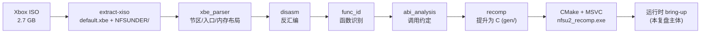
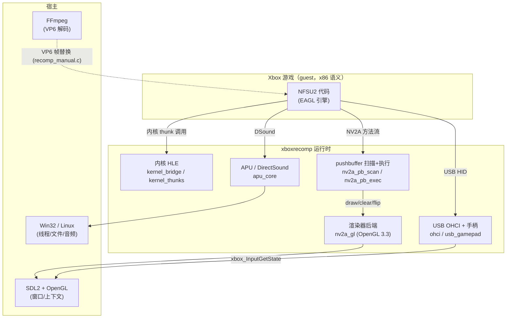
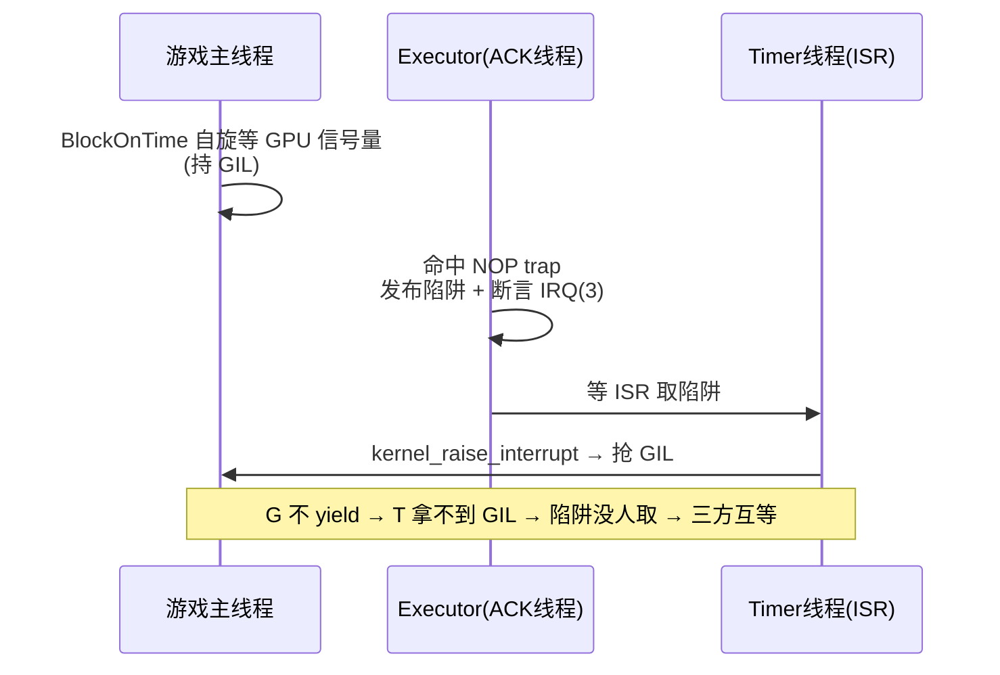
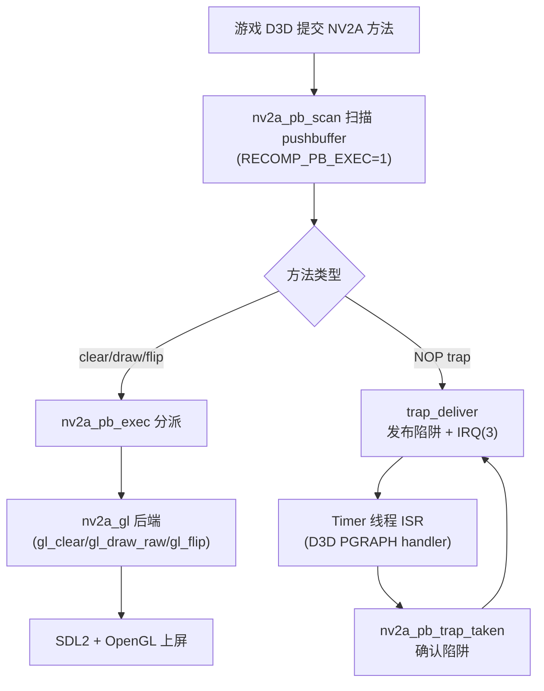

# NFS Underground 2 (Xbox) 静态重编译 —— Windows 移植复盘

> 本文记录把 2004 年 EA 的《极品飞车：地下狂飙 2》(Xbox NTSC-U, title_id `0x4541005A`)
> 通过 **xboxrecomp** 静态重编译到现代主机、并在 **Windows 上完整跑起来（画面 + BGM + 键盘操作 + 存档）**
> 的完整过程、关键坑与经验，以及向 **Linux ARM 掌机（RK3326 等）** 移植时的注意事项。

---

## 1. 项目概述

| 项 | 值 |
|---|---|
| 目标游戏 | NFS Underground 2 (Xbox, 2004, EA Black Box / EAGL 引擎) |
| 原始二进制 | `default.xbe`（4,038,656 B），入口 `0x0021B1CE` |
| 重编译方法 | xboxrecomp 静态重编译（XBE 的 x86 → 等效 C，再编译回本机） |
| 提升规模 | 19,535 个函数 → 79 个 `.c` 文件、约 132 MB |
| 当前状态 | ✅ Windows 上完整运行：渲染、BGM、FFmpeg 视频解码、键盘输入、存档读写 |

**核心结论**：xboxrecomp 的产物是「寄存器全局变量 + 软件 x87 栈 + 大内存数组」的等效 C，**不是**可读的反编译。
移植的工作量不在「看懂代码」，而在**逐个接通运行时子系统**（内核 HLE、渲染器、音频、USB、输入）。

---

## 2. 重编译流水线



流水线各步都是 `python -m tools.<step>`，前一步输出喂给下一步。**注意**：`regen.sh` 漏了第一步
`xbe_parser`，且 fork 的 vendored xboxrecomp 缺 `tools/{disasm,func_id,recomp}/output.py`，需从上游补齐。

---

## 3. 运行时架构



关键点：**游戏的所有硬件访问（内核、GPU、USB、音频）都通过运行时 HLE 转发到宿主**。游戏本身
仍然是那份 2004 年的 x86 机器码语义，只是换成了 C 表达、重新编译。

---

## 4. Windows 移植的关键坑与修复（按时间顺序）

| # | 症状 | 根因 | 修复 |
|---|---|---|---|
| 1 | MSVC 编译失败（5 个链接错误） | GCC 范围初始化器、`WinMain`、3 个 Switch 桩缺失、`xbox_file_read_hook` 重复定义 | 见 §4.1 |
| 2 | 游戏 boot 即退出（0xC000003A） | 存档目录 `%LOCALAPPDATA%` 被沙箱挡写，分区镜像没建 | 加 `NFSU2_SAVE_DIR` 环境变量 |
| 3 | 访问违例崩溃（0xFED00000） | OHCI MMIO 设了 `PAGE_NOACCESS` 但 VEH 路由没接 | 先改可读，最终改为注册 MMIO 设备模型（§4.2） |
| 4 | 开场视频解码极慢（10+ 分钟） | 没链接 FFmpeg，走 lifted MMX 解码器 | 下载 LGPL FFmpeg，改 CMake 链接 `.lib` |
| 5 | 黑屏、无窗口 | Windows 分支漏设 `RECOMP_PB_EXEC=1`，executor 直接 return | 补 `_putenv("RECOMP_PB_EXEC=1")`（§4.3） |
| 6 | 卡 NOP(40) trap 死锁 | MSVC 分支 `RECOMP_SPIN_HINT` 只 `_mm_pause()`，自旋不释放 GIL | 补全 yield（§4.4） |
| 7 | 键盘无响应 | GL 渲染器用 SDL 窗口，但按键记录在 GDI 窗口 | SDL 事件喂给 `xbox_FramebufferKeySet`（§4.5） |
| 8 | 车不动（按键映射） | 油门/刹车误映射到 A/X，游戏实际用 RT/LT 扳机 | 改为 RT/LT（§4.5） |

### 4.1 MSVC 构建修复

- `nv2a_pb_exec.c` 的 GCC 范围初始化器 `{ [0 ... N-1] = 1 }` → 惰性 `memset`。
- `main.c` 是 `int main`，去掉 CMake 的 `WIN32` 子系统。
- 新建 `win32_stubs.c`，桩掉 Switch 专用函数（`xbox_guest_pin` 等）。
- `xbox_file_read_hook` 定义从内核移到游戏直接编译的 `text_patch.c`。

### 4.2 OHCI MMIO（输入的前置）

游戏 XPP 段的 USB 驱动通过 `--mmio-sections XPP` 提升，用运行时 MMIO accessor 读控制器寄存器。
Windows 上原本只把 0xFED00000 置 `PAGE_NOACCESS`（期望 VEH 路由到设备模型），但那个 VEH 没接，
直接崩溃。**正解**是像 Linux 一样，在**所有平台**上注册 MMIO 设备模型：

```c
xbox_MmioRegister(XBOX_OHCI0_BASE, XBOX_OHCI0_BASE + XBOX_OHCI_SIZE,
                  ohci_mmio_rd, ohci_mmio_wr, &s_hc[0]);
```

否则游戏读到的全是 0，USB 驱动不初始化（日志 `[OHCI0] not started after 30 s`），手柄永远没输入。

### 4.3 `RECOMP_PB_EXEC` —— 典型的「WIN32 分支漏项」

`main.c` 的运行时默认值是分平台的：

```c
#ifdef _WIN32
    _putenv("RECOMP_VBLANK=1"); _putenv("RECOMP_AC97_READY=plain"); _putenv("RECOMP_USB=1");
    // ← 原来这里漏了 RECOMP_PB_EXEC=1！
#else
    setenv("RECOMP_VBLANK", "1", 0); ... setenv("RECOMP_PB_EXEC", "1", 0);
#endif
```

而 `nv2a_pb_scan` 靠 `getenv("RECOMP_PB_EXEC")` 决定**是否解码 pushbuffer 方法**。Windows 上没设 →
扫描直接 return → 游戏从不解码任何 GPU 命令 → 永远黑屏、无窗口。

**教训**：`#ifdef _WIN32` / `#else` 的运行时默认值必须逐项对齐，漏一项就是「逻辑在跑但某个子系统
静默失效」。

### 4.4 GIL 自旋 yield —— 最隐蔽的死锁

同样的「WIN32 分支漏项」pattern，但后果是三向死锁：

```c
#if defined(_MSC_VER)
#define RECOMP_SPIN_HINT() _mm_pause()   // ← 只暂停 CPU，不释放 GIL
#else
#define RECOMP_SPIN_HINT() recomp_spin_hint()  // pause + 每64圈 recomp_spin_yield()
#endif
```

死锁环：



修复：MSVC 分支也走完整的 `recomp_spin_hint()`（每 16 圈唤醒硬件线程、每 64 圈 `recomp_spin_yield()`
把 GIL 让给 ISR/DPC）。修完 trap 立即被处理（`NOP trap handled, 2048 so far`），窗口出现。

### 4.5 输入与按键映射

输入链：`SDL 键盘 → gl_key(映射 VK) → xbox_FramebufferKeySet → keyboard_state → usb_gamepad HID 报告
→ OHCI USB → 游戏 XInput`。

PC 赛车风格映射（当前）：

| 键盘 | 功能 | Xbox |
|---|---|---|
| W | 油门 | RT |
| S | 刹车/倒车 | LT |
| A / D | 左转 / 右转 | 左摇杆 X |
| Space | 手刹 | B |
| Left Shift | 氮气 | White |
| Left Ctrl | 降档/特殊 | Y |
| ↑ ↓ ← → | 菜单导航 | D-pad |
| Enter | 确认 / 开始 | START + A |
| Esc | 返回 | BACK + B |
| Q | 备用 | Black |

**坑**：游戏用车动靠的是 **RT/LT 扳机**（`XBOX_BUTTON_RTRIGGER=7` / `LTRIGGER=6`），不是 A/X 面键。
一开始把油门映射到 A、刹车到 X，车纹丝不动；改到扳机立刻正常。

---

## 5. 渲染 + 陷阱握手（关键路径）



陷阱是 D3D 的软件同步原语（`BlockOnTime` 等 fence 等待）。executor 命中 trap 后**必须**等游戏 ISR
通过 PGRAPH handler 确认，否则 fence 事件永不置位、游戏卡死。这一整条链（DPC 队列、`KDPC.Inserted`、
DISPATCH 级 handler 包裹、trap 锁握手）上游已在 Linux/Switch 验证，Windows 只差 §4.4 的 GIL yield。

---

## 6. Linux ARM 掌机（RK3326 等）移植注意事项

上游 `nfsu2-sw` **已经**支持 Linux（SDL2 + OpenGL）与 Switch，所以 ARM 掌机不是从零开始，但要注意：

### 6.1 渲染 API：OpenGL ES vs 桌面 OpenGL

- `nv2a_gl` 写的是 **OpenGL 3.3 core**（FBO、`glTexSubImage2D`、`GL_UNPACK_ROW_LENGTH` 等）。
- RK3326 的 Mali-450 只到 **OpenGL ES 2.0**（部分 3.0），**没有桌面 GL 3.3**。
- 因此要么：
  - 用 **Mesa**（`panfrost`/`lima` + `llvmpipe`）软件实现桌面 GL 3.3（慢但能跑）；
  - 或把 `nv2a_gl` 移植到 **GLES 3.0**（去掉 `GL_UNPACK_ROW_LENGTH`、FBO 扩展等）。
- 桌面 GL 3.3 的 DXT 压缩纹理（`glCompressedTexImage2D`）在 GLES 里要注意扩展名差异。

### 6.2 性能：x87 + MMX 模拟是瓶颈

- 游戏是 x86 机器码语义，x87 浮点（`g_fp_stack[8]` + `g_fp_top`）和 MMX（`g_mm0..g_mm7`）都是
  **软件模拟的 TLS 全局变量**。ARM 上每次 fld/fstp 都是 TLS 读写，慢。
- 上游已有 `_localize_leaf_registers`（MMX 叶子函数寄存器局部化，IDCT ~7.8x）、
  `_localize_x87_stack`（x87 栈顶局部化）、`_localize_registers`（通用寄存器局部化）——**ARM 上这些
  必须开启**（Linux x86 上收益不大，ARM 上却是数倍）。
- 视频解码务必用 FFmpeg VP6（LGPL），**不要**走 lifted MMX 解码器（ARM 上不可接受）。

### 6.3 内存布局与 32 位地址空间

- guest 需要 64 MB RAM + 29 个镜像 ≈ 1.85 GB 连续地址空间 + 191 MB Extended VMA。
- 在 32 位 ARM（或 32 位用户态）上，这个地址空间可能放不下；要么 64 位内核 + 32 位用户态，
  要么裁剪镜像数量。
- 注意 `Extended VMA` 保留失败（Windows 上是 error 487 地址冲突）在 ARM 上要提前规划好基址。

### 6.4 音频与时间

- 游戏是软件混音（EA 引擎 → 5.1 ring voices），APU 按**墙钟**计步（`throttle()`）。
- ARM 上 `clock_gettime`/`QPC` 的换算要正确（`qemu_qpc_scale()`，避免 2.6h 溢出）。
- 音频输出用 SDL2 `SDL_QueueAudio`（跨平台）；注意 ARM 上的线程优先级（只有特定优先级时间片）。

### 6.5 输入与存档

- 键盘映射与 §4.5 相同（`RECOMP_KEYBOARD=1` 走 `xbox_FramebufferKeySet`）；掌机建议直接用 SDL 手柄。
- 存档在 `game/UDATA/`（`partition1\UDATA` → game 目录），不是 `save/`。
- 交叉编译要单独准备 **LGPL 的 FFmpeg**（只含 VP6）和 SDL2 的 ARM 库，不要链 GPL 版。

### 6.6 交叉编译清单

1. ARM toolchain（aarch64/armv7）+ SDL2 dev 包（ARM）。
2. FFmpeg `libavcodec`（仅 VP6，LGPL）+ `libavutil`，ARM 交叉编译。
3. 若用软件 GL：Mesa（`llvmpipe`）或 `lima`/`panfrost` 驱动。
4. CMake 打开 `RECOMP_LEAF_LOCALS` / `RECOMP_X87_LOCALS` / `RECOMP_REG_LOCALS`（ARM 性能关键）。
5. 内核 HLE 的 `__atomic_*`、`clock_gettime`、pthread 在 Linux 上是原生可用的，**不需要** Windows 那套 shim。

---

## 7. 经验教训

1. **「WIN32 分支漏项」是最隐蔽的一类 bug**：代码看起来编译通过、逻辑正常，但某个 `#ifdef` 分支少了一行
   默认值，整个子系统静默失效（`RECOMP_PB_EXEC`、`RECOMP_SPIN_HINT` 两次都栽在这）。
2. **诊断要分层**：从「游戏退出」→「无窗口」→「trap 死锁」→「GIL 不 yield」，每层都有对应的探针
   （`RECOMP_IRQL_TRACE`、`RECOMP_PB_EXEC_VERBOSE`、IRQ 线探针、watchdog 快照）。不要猜，加探针。
3. **设备模型要注册全**：MMIO 只做「可读 RAM」不够——设备驱动读到 0 会静默不初始化（OHCI 就是）。
4. **静态重编译的移植 = 运行时子系统逐个接通**，不是「改游戏代码」。游戏的 x86 语义一行没动。
5. **多平台共享一份 C 代码**：Windows/Linux/Switch 都编译同一份 `gen/`，所以修一个平台的坑
   （只要不是 `#ifdef` 漏项）对其他平台同样有效。

---

*生成时间：2026-10。作者：FASTSHIFT fork bring-up。*
